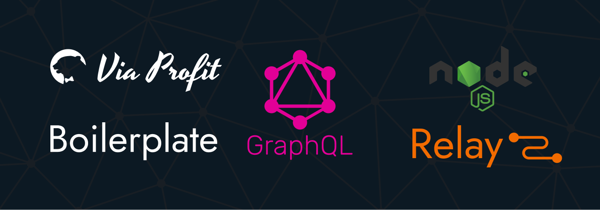

# GraphQL/Relay Boilerplate

> Шаблонная система, содержащая в своем дистрибутиве сервер GraphQL, систему управления контентом на RelayJS и веб-сайт на RelayJS с поддержкой рендеринга на стороне сервера (SSR).


## Что содержит бойлерплейт?

Этот бойлерплейт является монорепой и содержит в себе три репозитория, котореы могут быть выделены в отдельные репы в любой момент.

 - **graphql** - Репозиторий GraphQL сервера, в основе которого [@via-profit-services/core](https://github.com/via-profit-services/core). Сервер реализован на NodeJS. В качестве базы данных предпочтение отдано [PostgreSQL](https://www.postgresql.org). Для кэша используется [Redis](https://redis.io)

 - **website** - Репозиторий с заготовкой для разработки полноценного веб-сайта на [RelayJS](https://relay.dev). Возможна разработка как одностроничного (SPA) сайта, так и многостраничного сайта. В сборку заложена поддержка шаблонов.

 - **admin** - Репозиторий с заготовкой для разработки CRM-системы или полноценного веб-сайта на [RelayJS](https://relay.dev).В сборку заложена поддержка шаблонов для веб-сайта.

## Для чего?

Этот бойлерплейт создан для:

 1. Для возможности быстро начать разработку сайта или CRM-системы не расходуя время на подготовку репозитория, списка пакетов, модулей и построения архитектуры будущего приложения.
 
 2. Для возможности фронтендеров прикоснуться к бэкэнду на GraphQL не изучая его предварительно.

 3. Для того, чтобы было


## Как с этим работать?

Soon

## Настройка окружения проекта graphql для локального использования

1. Создайте и/или настройте базу данных PostgreSQL:

```bash
$ sudo -u postgres psql # To go to psql shell
```

_Пример конфигурации базы данных_:

```sql
create database boilerplate; -- Create database
create user boilerplate with password 'admin'; -- Create user
alter database boilerplate owner to boilerplate; -- Grant all privileges
```

2. Скопируйте `.env.example` файлы в файлы с именем`.env` для каждого проекта:

```bash
$ cp ./packages/website/.env.example ./packages/website/.env && cp ./packages/admin/.env.example ./packages/admin/.env && cp ./packages/graphql/.env.example ./packages/graphql/.env && cp ./packages/graphql/.knex/.env.example ./packages/graphql/.knex/.env
```

Заполните файлы `.env` в соответствии с вашими данными.

3. Создайте JWT ключи.

Чтобы JWT работал, необходимо сгенерировать SSH-ключи с использованием алгоритма, например, **RS256**.

**Замечание:** _При запросе парольной фразы просто нажмите Enter, чтобы оставить этот параметр пустым. То же самое необходимо сделать при подтверждении парольной фразы._

В корне проекта (на том же уровне, что и `package.json`) создайте каталог ключей и создайте в нем ключи, выполнив команды:

```bash
$ mkdir -p ./packages/graphql/.keys
$ ssh-keygen -t rsa -b 4096 -m PEM -f jwtRS256.key  # Don't add passphrase, just press Enter
$ openssl rsa -in jwtRS256.key -pubout -outform PEM -out jwtRS256.key.pub
$ mv ./jwtRS256.key ./packages/graphql/.keys/
$ mv ./jwtRS256.key.pub ./packages/graphql/.keys/
```

4. Скомпилируйте миграции.

```bash
$ npm run build:migrations
```

5. Примените миграции.

```bash
$ npm run migrate:latest
```

6. Сгенерируйте Relay артифакты и запустите все проекты

**Note:** _Вы увидите ошибки после запуска `npm run start`. Просто вызовите команду `npm run prepare:relay` один раз_

```bash
$ npm run start
$ npm run prepare:relay
```

7. **(необязательно)** Примените сиды.

```bash
$ npm run seed:run
```